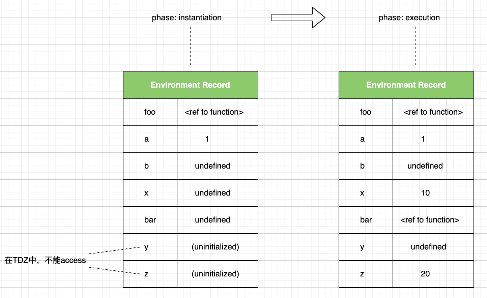

# Chapter 3. Environment record (scope)

> Environment record 对应的是 scope

> > Environment record is used to explain the behavior of name resolution in nested functions and blocks.
>
> Environment record 是一个抽象概念，可以将其理解为一个 plain object.
>
> name resolution 也就是 identifier resolution. name 包括 variable name, function name, parameter name, class name 等。
>
> Spec 经常用到 binding 这个词，a binding is the association between an identifier and a value.

根据代码类型 (比如 global code, module code, function code 等)将 environment record 粗略分为：

1.  Global environment record (由 object environment record + declarative environment record 组成)

    - \[[OuterEnv]] is `null`.

    - bindings for the top-level declarations. (全局中最上层声明的所有绑定)

      > object environment record 关联一个 binding object，即 the global object, 它包括：global built-in bindings (比如`console`)和 VariableDeclaration (指的是用`var`声明), FunctionDeclaration (函数声明), AsyncFunctionDeclaration (异步函数声明)等。
      >
      > declarative environment record 包括: LexicalDeclaration (指的是用`let`或`const`声明), ClassDeclaration (类声明).

      ```js
      // Legacy variable using `var`, added to object environment record.
      var x = 10;
      // Modern variable using `const`, added to declarative environment record.
      const y = 20;

      console.log(x, y); // 10 20
      // in global environment, `this` is the global object
      // which is the binding object of object environment record.
      console.log(this.x, this.y); // 10 undefined

      this.x = 1;
      this.y = 2;

      console.log(x, y); // 1 20
      ```

    - `this` is the global object.
      - `window` for browsers, `self` for web workers
      - `global` for node.js
      - `globalThis` for all

    > > Global environment record is used to represent the outer most scope that is shared by all of the ECMAScript script elements.
    >
    > 所有 script 元素共享 global environment record。

    下面这段代码说明：一个 script 中出现 exception 只会阻断该 script 中后续代码的执行，不会阻断其他 script 代码的执行。所有 script 共享 global environment record，随着 script 的执行，global environment record 在变化。

    ```js
    <script>
      console.log(x); // ReferenceError: x is not defined
      console.log(123); // 不会打印123
    </script>
    <script>
      let x = 1;
      const y = 10;
    </script>
    <script>
      console.log(x); // 1
      x = 2;
      console.log(x); // 2

      console.log(y); // 10
      y = 20; // TypeError: Assignment to constant variable.
    </script>
    ```

2.  Module environment record (一种 declarative environment record)

    - \[[OuterEnv]] is global environment record.

    - bindings for the top-level declarations. (模块中最上层声明的所有绑定)

      > 包括 VariableDeclaration (指的是用`var`声明), FunctionDeclaration, AsyncFunctionDeclaration, LexicalDeclaration (指的是用`let`或`const`声明), ClassDeclaration 等.

    - `this` is `undefined`.

3.  Function environment record (一种 declarative environment record)

    > 每次**执行**函数会生成**新的**environment record.

    - \[[OuterEnv]]的情况：

      > **创建**函数时会确定它的\[[Environment]](即：将函数声明所在的 environment record 存入它的\[[Environment]]，请参考 spec 中的 OrdinaryFunctionCreate。\[[Environment]]是函数对象的一个 internal slot)。**执行**函数时，新生成的 environment record 的\[[OutEnv]]被设置为\[[Environment]]。

    - bindings for the top-level declarations. (函数中最上层声明的所有绑定)

      > 包括 VariableDeclaration (指的是用`var`声明), FunctionDeclaration, AsyncFunctionDeclaration, LexicalDeclaration (指的是用`let`或`const`声明), ClassDeclaration 等.

    - `this`的情况：

      > **创建**函数时会确定它的\[[ThisMode]](请参考 spec 中的 OrdinaryFunctionCreate，\[[ThisMode]]是函数对象的一个 internal slot)，其值是 lexical, strict, or gloabl.
      >
      > > - **lexical** means that this refers to the this value of a lexically enclosing function. (这里用 environment 更恰当，比如 module 中的 arrow function)
      >
      > arrow function 的\[[ThisMode]]是 lexical.
      >
      > > - **strict** means that this value is used exactly as provided by an invocation of the function.
      >
      > strict mode 下的 function declaration 和 function expression 的\[[ThisMode]]是 strict.
      >
      > > - **global** means that a this value of undefined or null is interpreted as a reference to the global object, and any other this value is first passed to ToObject.
      >
      > non-strict mode 下的 function declaration 和 function expression 的\[[ThisMode]]是 global.

      确定`this`的具体算法会用到 EvaluateCall(func, ref, arguments, tailPosition) (抽象运算)：

      The abstract operation EvaluateCall takes arguments func (an ECMAScript language value), ref (an ECMAScript language value or a Reference Record), arguments (a Parse Node), and tailPosition (a Boolean).

      1. If ref is a Reference Record, then
         1. If IsPropertyReference(ref) is true, then
            > 以 property accessor 形式调用函数，thisValue 是 ref.\[[Base]]，见示例 1 和 2
            1. Let thisValue be GetThisValue(ref).
         2. Else,
            > 以 identifier 形式调用函数，thisValue 是`undefined` (注意这是排除了 with statement 的情况，排除原因是其不被推荐使用)，见示例 3
            1. Let refEnv be ref.\[[Base]].
            2. Assert: refEnv is an Environment Record.
            3. Let thisValue be refEnv.WithBaseObject(). (如果是 with statement，thisValue 是 with object，否则 thisValue 是`undefined`)
      2. Else,
         > 以其他形式调用函数，比如：IIFE，thisValue 是`undefined`，见示例 4 和 5
         1. Let thisValue be undefined.
      3. Let argList be ? ArgumentListEvaluation of arguments.
      4. If Type(func) is not Object, throw a TypeError exception.
      5. If IsCallable(func) is false, throw a TypeError exception.
      6. If tailPosition is true, perform PrepareForTailCall().
      7. Let result be Call(func, thisValue, argList).
         > 这里会调用 Function Object 的\[[Call]]，它又会调用 OrdinaryCallBindThis(F, calleeContext, thisArgument)，它会根据 Function Object 的\[[ThisMode]]来绑定 this value
         >
         > \[[ThisMode]]的值：
         >
         > 1. 如果是 lexical，直接返回 (意思是不进行最后一步的绑定操作，所以说 arrow function environment record 不绑定 this value)
         > 2. 如果是 strict，thisValue 就是 thisArgument
         > 3. 其他，即：global，如果 thisArgument 是`undefined`或`null`，thisValue 就是 the global object, 否则 thisValue 就是 ToObject(thisArgument)
         > 4. ... (最后一步操作是为 environment record 绑定 this value)
      8. ... (忽略了后续步骤)

      ```js
      const foo = {
        bar: function () {
          console.log(this);
        },
      };

      // 示例 1
      // Reference record:
      // {[[Base]]: foo指向的对象, [[ReferencedName]]: 'bar', [[Strict]]: false}
      foo.bar(); // foo, the dot notation
      foo['bar'](); // foo, the bracket notation
      // 示例 2
      // Reference record:
      // {[[Base]]: 临时对象, [[ReferencedName]]: 'bar', [[Strict]]: false}
      ({
        x: 1,
        bar: function () {
          console.log(this.x); // 1
        },
      }).bar();

      const bar = foo.bar;
      // 示例 3
      // Reference record:
      // {[[Base]]: globalEnvRec, [[ReferencedName]]: 'bar', [[Strict]]: false}
      bar(); // the global object (如果是在strict mode下，结果是undefined)

      // 示例 4
      // 没有Reference record
      // the global object (如果是在strict mode下，结果是undefined)
      (false || foo.bar)();

      // 示例 5
      // 没有Reference record
      // the global object (如果是在strict mode下，结果是undefined)
      (function () {
        console.log(this);
      })();

      // 示例 6
      this.x = 10;
      const qux = {
        x: 20,
        bar: () => console.log(this.x),
        baz() {
          let arrow = () => console.log(this.x);
          return arrow();
        },
      };

      // qux.bar指向的函数的[[ThisMode]]是lexical, 它的this会refer to外部环境的this，
      // 外部环境是global environment record，它的this是the global object
      qux.bar(); // 10
      // arrow指向的函数的[[ThisMode]]是lexical，它的this会refer to外部环境的this，
      // 也就是baz环境的this，接着看baz环境怎么生成的？Reference record:
      // {[[Base]]: qux指向的对象, [[ReferencedName]]: 'baz', [[Strict]]: false}
      qux.baz(); // 20
      ```

---

浏览器的`setTimeout`, `setInterval`调用 handler 的方式是`handler.call(window)`，而不是`handler()`. (参考：<https://html.spec.whatwg.org/multipage/timers-and-user-prompts.html#timers>).

```js
'use strict';
const user = {
  firstName: 'John',
  sayHi() {
    console.log(`Hi, I am ${this.firstName}.`);
  },
};

// 如果setTimeout不做特殊处理，这里会报TypeError: cannot read properties of undefined.
setTimeout(user.sayHi, 1000); // Hello, I am undefined.

// 如何让`this`是user指向的对象呢？
const boundSayHi = user.sayHi.bind(user);
setTimeout(boundSayHi, 1000); // Hello, I am John.
```

---

生成 environment record 实际上是在 instantiation (实例化)，这个过程是在**代码执行**前进行的。步骤如下：

> 基于 spec 的 GlobalDeclarationInstantiation 和 FunctionDeclarationInstantiation 的修改
>
> parse 阶段 (参考《Misc》)会收集所有 FunctionDeclaration, ParameterName, VariableDeclaration, LexicalDeclaration 等集合
>
> 1. LexicalDeclaration 集合自身内有重名，直接报 SyntaxError
> 2. LexicalDeclaration 集合与其他集合有重名，直接报 SyntaxError
>
> 弄清楚以下几个步骤，hoisting 就很容易理解，spec 中并不存在 hoisting 这个术语。

1. FunctionDeclaration list (AsyncFunctionDeclaration 等属于这一类)，针对每个元素：

   - 如果遇到重名的情况，用**最后一个声明**
   - 在 environment record 中创建 binding，初始化为函数对象

2. FormalParameterName list，针对每个元素：

   > function environment record 才会进行这个步骤

   - 如果遇到与上面 list 重名的情况
     - 如果 FormalParameterName 集合中有默认值的情况，用该声明覆盖之前的声明（此处简单处理了，实际上要复杂很多，这里会创建一个单独的 environment record）
     - 否则，忽略该声明
   - 如果遇到重名的情况，忽略该声明
   - 在 environment record 中创建 binding，如果未提供实参，初始化为`undefined`，否则初始化为实参

3. VariableDeclaration list (指的是用`var`声明)，针对每个元素：

   - 如果遇到与上面 list 重名的情况，忽略该声明
   - 如果遇到重名的情况，忽略该声明
   - 在 environment record 中创建 binding，初始化为`undefined`

4. LexicalDeclaration list (指的是用`let`或`const`声明，ClassDeclaration 属于这一类)，针对每个声明：

   - 在 environment record 中创建 binding，**不进行初始化**，进入 Temporal Dead Zone (TDZ，在初始化前不能 access 标识符，否则报 ReferenceError)

```js
function test(a, b) {
  var x = 10;

  let y;

  const z = 20;

  function foo() {}

  var bar = function _bar() {};

  (function baz() {});
}

test(1);
```


