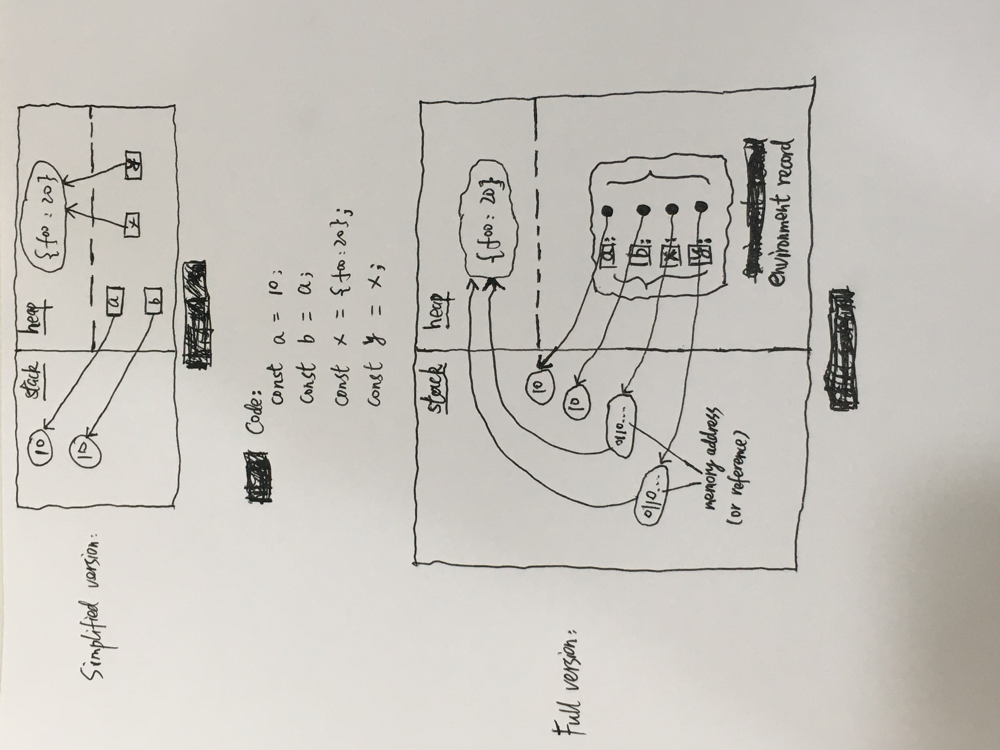

# Evaluation strategy

Evaluation strategy (求值策略)是表达式求值的一组规则，比如：什么时候对参数求值，以什么顺序对参数求值，binding strategy (绑定策略)。

> JS uses **eager** evaluation of arguments, in **left-to-right** order.
>
> 调用函数**前**进行参数求值，以从**左到右**的顺序。

绑定策略不仅用于参数传递，也用于**赋值操作** (其实参数传递也涉及到赋值操作)。

> In JS, primitive values are passed **by value** and objects are passed **by sharing**.
>
> by sharing 指的是不同变量可以 share 同一对象，通过某个变量修改对象的属性，其他变量可以看到这种修改；但对某个变量重新赋值，其他变量会保持不变 (这是 by sharing 和 by reference 的区别，by reference 是对某个变量重新赋值，那其他变量也赋了新值)。
>
> 

```js
let a = { n: 1 };
const b = a;

// a.x的reference record:
// { [[Base]]: a指向的对象, [[ReferencedName]]: 'x', [[Strict]]: false }
// a的reference record:
// { [[Base]]: globalEnvRec, [[ReferencedName]]: 'a', [[Strict]]: false }
a.x = a = { n: 2 };
console.log(a.x, b.x); // undefined {n: 2}
```
