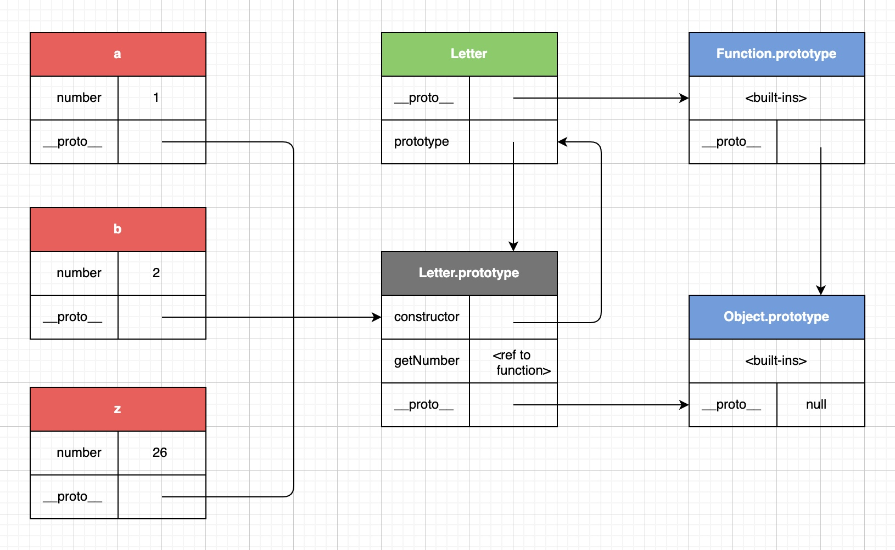
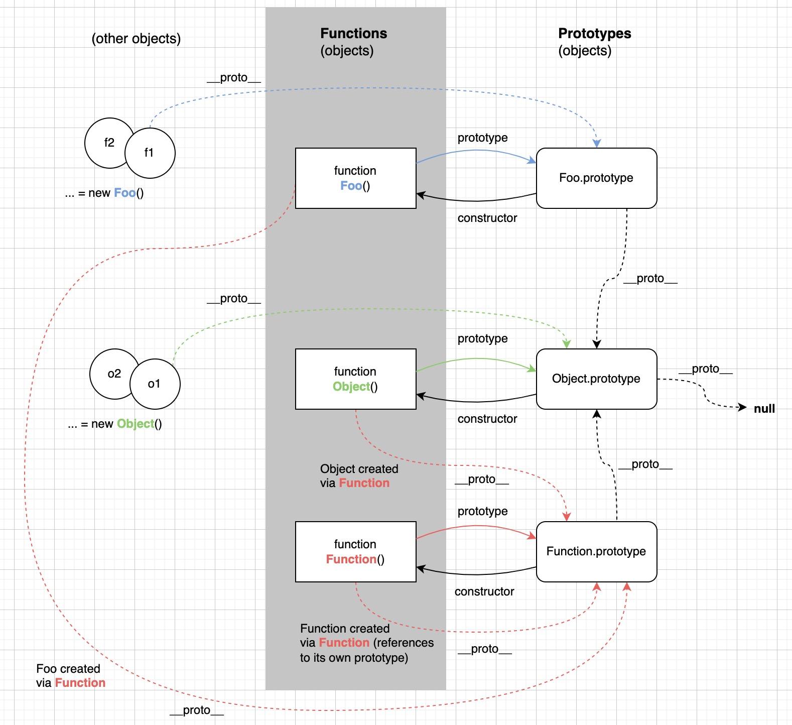
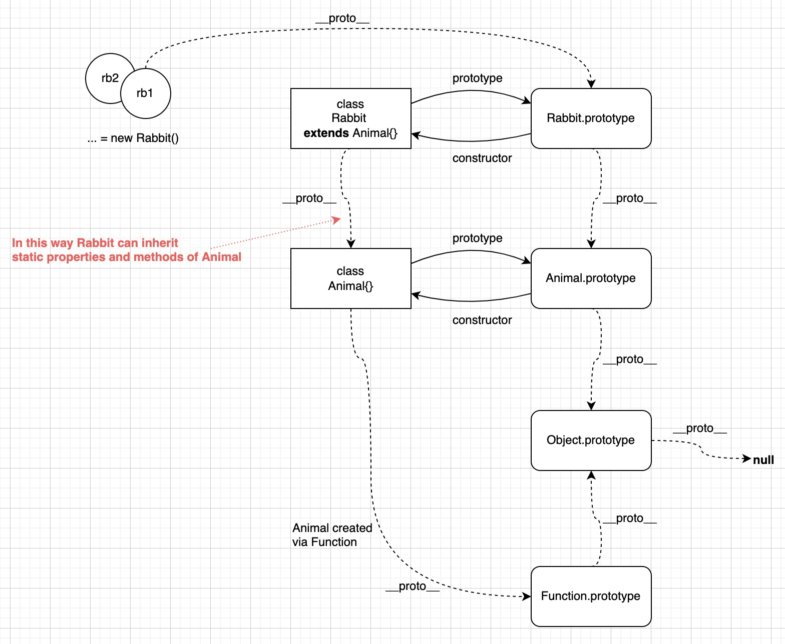

## Object

> > An object is a collection of properties and has a single prototype object. The prototype may be the `null` value.
>
> 对象是属性的集合，它有**一个**原型对象，这个原型对象可能是`null`.

创建对象时会确定它的\[[Prototype]] (\[[Prototype]]是一个 internal slot，以`__proto__`的方式向外暴露)

## Prototype

> > A prototype is an object that provides shared properties for other objects.
>
> 原型是为其他对象提供共享属性的对象。

默认情况下，对象的原型是`Object.prototype`。可以通过`__proto__` (非常适合用来理解相关概念)或`Object.create`来显性指定对象的原型。

原型也是一个对象，所以原型也会有自己的原型，这样就形成了 prototype chain (原型链)。

> The rule for property resolution is: if a property is not found in the object itself, there is an attempt to look it up in the prototype, in the prototype of the prototype, and so on — until the whole prototype chain is considered.
>
> 属性解析的规则是：如果属性在自身对象中找不到，就去原型中找，原型中找不到，就去原型的原型中找，直至整个原型链。
> 大致过程：
>
> 1. 属性解析时会生成一个 reference record (见《Chapter 2. Reference recode》)
> 2. 调用 GetValue 抽象运算
> 3. 因为 IsPropertyReference 是`true`, 调用\[[Get]]抽象运算
> 4. 调用 OrdinaryGet 抽象运算（里面有详细步骤）

```js
// Base object
const point = {
  x: 10,
  y: 20,
};

// use `__proto__`
const point3D = {
  z: 30,
  __proto__: point,
};

console.log(
  point3D.x, // 10, from base object
  point3D.y, // 20, from base object
  point3D.z // 30, own
);
```

如果想让多个对象继承相同的原型，我们可以先创建原型，然后设置对象的原型：

```js
// Generic prototype for all letters.
const letter = {
  getNumber() {
    return this.number;
  },
};

const a = { number: 1, __proto__: letter };
const b = { number: 2, __proto__: letter };
// ...
const z = { number: 26, __proto__: letter };

console.log(
  a.getNumber(), // 1
  b.getNumber(), // 2
  z.getNumber() // 26
);
```

不过上面的写法很繁琐，class 作为一种语法糖能让代码变得简洁：

```js
class Letter {
  constructor(number) {
    this.number = number;
  }

  getNumber() {
    return this.number;
  }
}

const a = new Letter(1);
const b = new Letter(2);
// ...
const z = new Letter(26);

console.log(
  a.getNumber(), // 1
  b.getNumber(), // 2
  z.getNumber() // 26
);
```

技术上来说，class 是`constructor + prototype`的组合，`constructor`创建对象，并自动设置这些对象的原型 (原型存在于`<constructor>.prototype`)。

> > A constructor is a function which is used to create objects, and set their prototype automatically.
>
> 构造器是用来创建对象，并设置他们原型的函数。

可以显性使用构造器来创建对象，实际上，在引入`class`前开发人员就是这么做的：

```js
function Letter(number) {
  this.number = number;
}

Letter.prototype.getNumber = function () {
  return this.number;
};

const a = new Letter(1);
const b = new Letter(2);
// ...
const z = new Letter(26);

console.log(
  a.getNumber(), // 1
  b.getNumber(), // 2
  z.getNumber() // 26
);
```

构造器对象关系图：



---

对象布局图：



---

类继承图：


